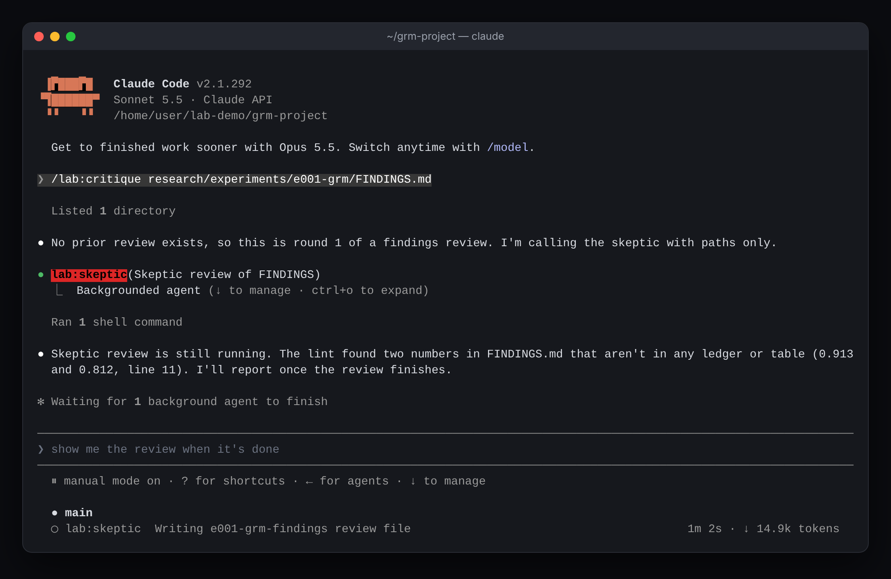
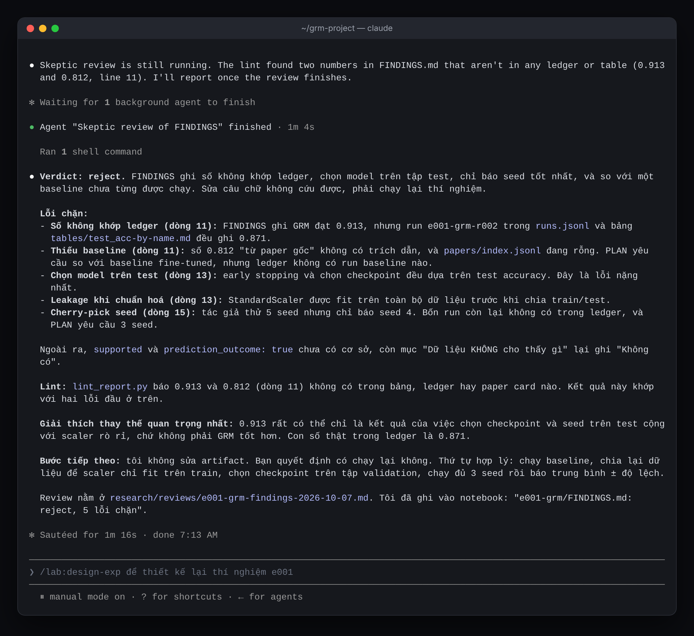
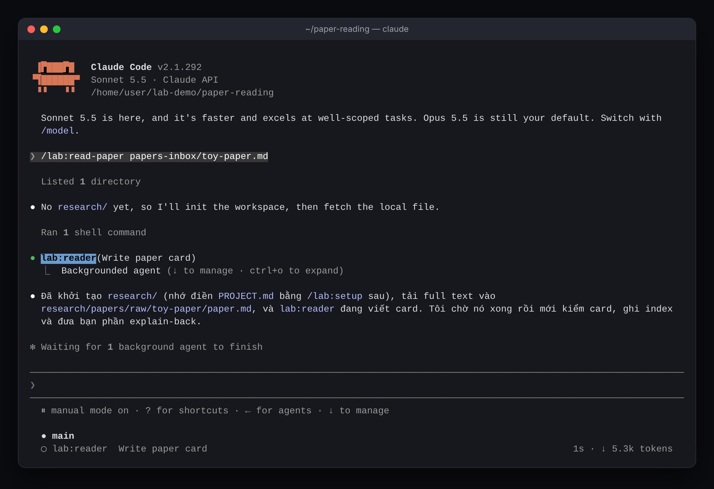
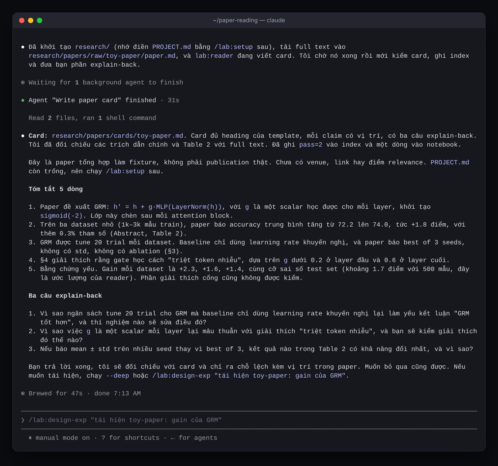
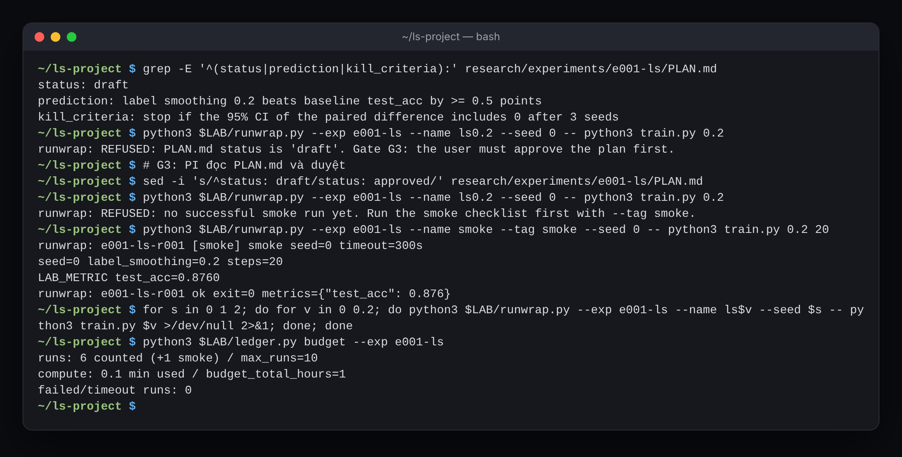
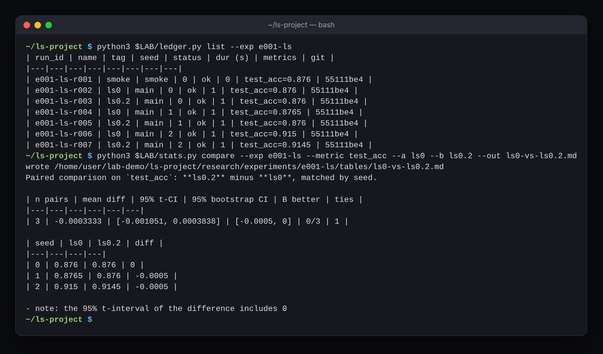

# Research Squad（`lab`）

[English](README.md) · [Tiếng Việt](README.vi.md) · [中文](README.zh.md) · [Français](README.fr.md) · **日本語**

AI/ML 研究のための Claude Code プラグインです。**Lead**（メインセッション。`/lab:*` スキルで動きます）が **7 つのサブエージェント** を取りまとめ、リポジトリ内の `research/` フォルダを共有のラボノートとして使います。エージェントはスループット（読む、実行する、確認する、下書きする）を担当し、あなたは G1〜G5 の 5 つのゲートで、センスと意思決定を握ります。

単発の「deep research」と比べて、このプラグインが加えるものは 3 つです。

1. **実行台帳（run ledger）** と「すべての数値は実行に遡れる」というルール。プロンプトではなく、スクリプトとフックで強制します。
2. **`skeptic`**：独立したレビュアー。受け取るのは成果物のパスだけで、著者の推論は見えません。
3. **学習ループ**：予測と結果、時間の見積もりと実際の所要時間のキャリブレーション（calibration）を測ります。

**5 つの言語**に対応しています：English（デフォルト）、Tiếng Việt、中文、Français、日本語。[言語](#言語)を参照してください。

## インストール

必要なもの：Claude Code（言語ピッカーには v2.1.271 以降、評価には v2.1.269 以降）、`PATH` 上の `python3` ≥ 3.10。スクリプトは標準ライブラリだけを使います。PDF のテキスト取得には `pdftotext`（poppler）が任意で使えます。

GitHub から：

```text
/plugin marketplace add quocthai179/computer-science-squad-agents
/plugin install lab@computer-science-squad-agents
```

ローカル開発：

```bash
claude --plugin-dir ./lab        # ファイルを編集してから /reload-plugins
claude plugin validate ./lab
```

## 言語

| コード | 言語 | 備考 |
|---|---|---|
| `en` | English | デフォルト |
| `vi` | Tiếng Việt | 英語の技術用語はそのまま |
| `zh` | 中文 | 簡体字 |
| `fr` | Français | 丁寧な文体（vous） |
| `ja` | 日本語 | 丁寧語（です・ます） |

**言語に従うもの：** `research/` に書き込まれるすべて（ノート、カード、プラン、レビュー、レポート）とその出発点のテンプレート（`templates/<lang>/`）、そしてエージェントからあなたへの返答。**変わらないもの：** frontmatter のキーと固定値（`status: approved`、`verdict: reject`）、JSONL のフィールド名、ファイル名、id、`[@paper-id, loc]` / `[run:id]` アンカー。これによりスクリプトはどの言語でも動きます。指示、playbook、スクリプトの出力は英語で、Lead があなたの言語で伝え直します。

**言語の決め方**（最初に一致したものが優先）：

1. `research/PROJECT.md` の `language:`。`/lab:setup` があなたの使っている言語で書き込みます。後から変えるには `python3 <plugin>/scripts/lang.py set fr`。
2. プラグインのオプション（新しいプロジェクト向けの個人のデフォルト）：
   ```bash
   claude plugin configure lab@computer-science-squad-agents --values-stdin <<< '{"language":"ja"}'
   ```
   または Claude Code 内で `/plugin configure lab@computer-science-squad-agents`。値を保存するまでオプションは「未設定」で、英語が使われます。
3. English。

チャットでの返答は、プロジェクトの言語にかかわらず、あなたが入力した言語に従います。5 つの言語どれで自然に頼んでも、適切なスキルが起動します（「khảo sát…」「文献综述…」「revue de littérature…」「文献調査…」）。

## コマンド

| やりたいこと | コマンド | 成果物 |
|---|---|---|
| プロジェクト開始（G1） | `/lab:setup [タイトル]` | `research/`、Heilmeier 形式の `PROJECT.md` |
| トピックを素早くつかむ | `/lab:survey <トピック> [--quick]` | 出典付きのサーベイ、空白、論文同士の矛盾 |
| 1 本の論文を深く理解する | `/lab:read-paper <arXiv id \| URL \| ファイル> [--deep]` | 論文カード、explain-back |
| 任意の成果物を批評する | `/lab:critique <パス>` | 独立したレビュー |
| アイデアを探す（G2） | `/lab:ideate [フォーカス]` | 新規性チェックを通ったアイデアカード |
| 実験を設計する（G3） | `/lab:design-exp <idea-id \| 問い>` | `PLAN.md` |
| 実験を実行する | `/lab:run-exp <exp-id>`（あなたが入力したときだけ） | 実行台帳 |
| 分析する | `/lab:analyze <exp-id>` | `FINDINGS.md`、表、図 |
| 書く（G4、G5） | `/lab:write-up <種類> [slug]` | `claims.md` → `draft.md` → `final.md` |
| 週次の振り返り | `/lab:retro [日数]` | 振り返り、`LESSONS.md`、calibration |
| 次にやること | `/lab:next` | ちょうど 1 つのことと、その理由 |

どのスキルにも代替手順があります。サブエージェントを呼べない場合、Lead は同じ playbook に沿って順番に自分で進め、そのことをはっきり伝えます。

## チーム構成

| エージェント | 役割 | ツール | モデル | 書き込み先 |
|---|---|---|---|---|
| `scout` | 文献の偵察、1 回目の読み | Read, Glob, Grep, WebSearch, WebFetch, Write | sonnet | `surveys/<slug>/scout-*.jsonl` |
| `reader` | 全文での 2 回目の読み | Read, Glob, Grep, Write | sonnet | `papers/cards/` |
| `writer` | 唯一の書き手 | Read, Glob, Grep, Write, Edit | inherit | `surveys/`、`reports/` |
| `skeptic` | 独立した批評者 | Read, Glob, Grep, WebSearch, WebFetch, Write | opus | `reviews/` |
| `experimenter` | 実験エンジニア | Read, Glob, Grep, Edit, Write, Bash | sonnet | コード、`experiments/<id>/` |
| `analyst` | 結果の分析 | Read, Glob, Grep, Bash, Write | sonnet | `FINDINGS.md`、表、図 |
| `ideator` | 仮説の生成 | Read, Glob, Grep, Write | opus | `ideas/cards/` |

どのエージェントも `Agent` ツールを持たないので、呼び出しの連鎖は常にフラットです。`scout` と `reader` は信頼できない内容を読むため、`Bash` も `Edit` もありません。`analyst` は `Edit` を持たないので、学習コードを変更できません。受け渡しはすべてファイル経由で、`TASK BRIEF` / `RECEIPT` の取り決めに従います（`playbooks/handoff.md`）。

## ワークスペース

```text
research/
├── PROJECT.md          # Heilmeier 形式のブリーフ、stage、計算環境、言語
├── notebook/           # YYYY-MM-DD.md、追記のみ（scripts/notebook.py）
├── decisions.md        # 各ゲートでの意思決定
├── papers/             # index.jsonl、refs.bib、cards/、raw/（gitignore）
├── surveys/<slug>/     # angles.md、scout-*.jsonl、evidence.jsonl、gaps.md、survey.md
├── ideas/              # backlog.md、cards/
├── experiments/<id>/   # PLAN.md、runs.jsonl、runs/（gitignore）、FINDINGS.md、tables/、figures/
├── reports/<slug>/     # claims.md、draft.md、final.md
├── reviews/
└── lessons/            # LESSONS.md（50 行まで）、calibration.jsonl、squad-issues.md、retros/
```

サブエージェントは `CLAUDE.md` を読み込むため、`/lab:setup` はリポジトリの `CLAUDE.md` に共通ルールのブロックを追加します（`<!-- lab:begin -->` と `<!-- lab:end -->` の間）。

## ガードレールとその強制方法

| ルール | 強制するもの |
|---|---|
| `PLAN.md` に `prediction` か `kill_criteria` がなければ実行しない | `runwrap.py` が拒否（exit 3） |
| 承認済みのプランだけが動く（G3） | `runwrap.py` が `status: approved` または `running` を要求 |
| 本番の実行の前に smoke | `runwrap.py` が `ok` の smoke 実行を要求 |
| 実行回数の予算 | `runwrap.py` が `max_runs` と比較。タイムアウトは `budget_minutes_per_run` から |
| 修正は最大 3 回 | 3 回連続で失敗すると `runwrap.py` が拒否。あなたが許可した場合のみ `--after-review` |
| 台帳、`tables/`、`figures/` を手で編集しない | `PreToolUse` フック（`scripts/guard_generated.py`） |
| 実行中に評価、指標、テストデータを変えない | プランが `approved`/`running` の間、フックが `protected_files` を保護 |
| 本文の数値は表、台帳、カードのいずれかに存在すること | `lint_report.py` |
| 最終稿にプレースホルダを残さない | `lint_report.py` |
| `closest_prior_work` を確認せずに「novel」「初めて」「SOTA」と書かない | `lint_report.py`（5 言語対応） |
| 引用は解決できること | `cite_check.py`（arXiv、doi.org、Semantic Scholar。`--offline` はローカルのみ） |
| レビューは最大 2 ラウンド、サーベイの追加検索は 1 回、scout は最大 5 | スキル内 |

## 学習スクリプトが指標を報告する方法

すべての実行は `runwrap.py` を通します。

```bash
python3 <plugin>/scripts/runwrap.py --exp e001-ls --name baseline --tag baseline --seed 0 -- python train.py
```

学習スクリプトは `$LAB_SEED` からシードを読み、指標を 2 通りのどちらかで報告します。`LAB_METRIC test_acc=0.8312` という行を出力するか、JSON を `$LAB_METRICS_FILE` に書き込みます。台帳には git SHA、dirty フラグ、設定のハッシュ、シード、時間、終了コード、指標が記録されます。

## スクリプト

| スクリプト | 役割 |
|---|---|
| `init_workspace.py` | `research/` を作成（冪等、`--lang`）、`CLAUDE.md` にルールブロックを追加 |
| `lang.py` | ワークスペースの言語を表示・設定 |
| `paper_fetch.py` | arXiv id、URL、ファイル → メタデータ、展開済み LaTeX または PDF、`index.jsonl`、`refs.bib` |
| `paper_index.py` | scout の出力を統合して重複を除去。一覧表示、フィールド編集 |
| `runwrap.py` | 学習コマンドをラップし、ゲートを守り、台帳に書く |
| `ledger.py` | 実行の一覧、Markdown の表と SVG の図の生成、予算の表示 |
| `stats.py` | 平均、標準偏差、95% t 信頼区間、シードで対応づけた比較（bootstrap 区間付き） |
| `cite_check.py` | `[@id, loc]`、`\cite{}`、arXiv、DOI、`[run:id]` の引用を確認 |
| `lint_report.py` | プレースホルダ、出典のない数値、未確認の新規性の主張（en、vi、zh、fr、ja） |
| `calibration.py` | 予測と結果、見積もりと実際の時間、Brier スコア |
| `retro_digest.py` | `/lab:retro` 用の週のまとめと `/lab:next` 用の状態 |
| `notebook.py` | ノートへの追記 |
| `guard_generated.py` | 自動生成ファイルと保護ファイルの手編集を止めるフック |

## デモ

Claude Code での実際の実行のスクリーンショットです（ベトナム語のセッションなので、返答はベトナム語です）。入力は評価用のフィクスチャなので、再実行できます（[方法](../docs/screenshots/capture/README.md)）。

**`/lab:critique`：独立したレビュー。** Lead が `lab:skeptic` に渡すのはパスだけで、推論は渡しません。この実験レポートには 5 つの欠陥が仕込まれており、skeptic は行番号つきで 5 つすべてを名指ししています。





**`/lab:read-paper`：精読と explain-back。** `lab:reader` が全文を読んで論文カードを書き、Lead が要約と 3 つの質問を返します。自分の理解を試すためです。この論文は評価用に書いた合成のもので、reader は仕込まれた弱い根拠（不均等なチューニング、best of 3 seeds）を見抜いています。





**ガードレールはプロンプトではなくスクリプトに。** `runwrap.py` は未承認のプラン（G3）の実行を拒否し、smoke の前の本番実行も拒否します。すべての実行は git SHA つきで台帳に入ります。



**シードで対応づけた統計。** おもちゃの実験（合成データでのロジスティック回帰）では label smoothing は何も改善せず、`stats.py compare` は差の 95% 信頼区間が 0 を含むのでそう報告します。



## テスト

スクリプトのユニットテスト（リポジトリのルートで）：

```bash
pip install pytest
pytest tests
```

このテストは、5 つの言語すべてに 13 個のテンプレートがそろい、frontmatter のキー、見出しの数、チェックリストが英語版と一致していること、そして linter が英語、ベトナム語、中国語、フランス語、日本語の文章で動作することも確認します。

プラグインの評価（`evals/`、9 ケース）。1 回の実行は実際のモデル呼び出しで、あなたの利用枠を消費します。ケースは `scaffold.sh` でフィクスチャを作るため、`--scaffold` が必要です。

```bash
# 素早い反復：1 回の実行、ベースラインなし
claude plugin eval ./lab --scaffold --allow-tools Bash Write Edit Agent --runs 1 --ablation none
# 確認：3 回の実行、プラグインなしの系列と比べて Δ を見る
claude plugin eval ./lab --scaffold --allow-tools Bash Write Edit Agent
```

| ケース | 確認すること |
|---|---|
| `read-paper-card` | 英語の依頼 → 完全な論文カード、位置つきの引用、explain-back |
| `critique-planted-bugs` | `skeptic` が仕込まれた 5 つの欠陥をすべて名指しする |
| `design-exp-plan` | 完全な `PLAN.md`、予測の記録、プランを勝手に承認しない（G3） |
| `no-trigger-simple-question` | 単発の事実の質問ではスキルを呼ばない |
| `next-step-analyze` | `/lab:next` が完了した実行の分析を勧める |
| `setup-fr` | フランス語の依頼 → フランス語のワークスペース、`language: fr` |
| `read-paper-ja` | 日本語の依頼 → 日本語のカードと返答 |
| `critique-zh` | 中国語の依頼 → 中国語で返答し 5 つの欠陥を名指しする |
| `read-paper-vi` | ベトナム語の依頼 → ベトナム語のカードと explain-back |

サーベイはウェブが必要で決定的ではないため、評価ケースはありません。golden task で評価してください。

## 選んだデフォルト

1. 主な環境：Claude Code。Claude アプリでのサブエージェントとフックは**未検証**です。
2. 名前とプレフィックス：`lab`。
3. ワークスペース：各リポジトリの `research/`。
4. 成果物の言語：デフォルトは英語。`vi`、`zh`、`fr`、`ja` に対応。論文の草稿はプロジェクトと別の言語でも構いません。
5. 計算環境：`/lab:setup` の中で記入。プランの予算はそこから決まります。
6. `skeptic` は `opus` を使用。別のモデルファミリーをレビュアーにすることはまだしていません。

## 制限事項

- トークンコスト：フルのサーベイは scout 4〜5 個と reader 5〜8 個を動かします。狭い質問には `--quick` を使ってください。
- `skeptic` は著者と同じモデルファミリーなので、盲点を共有している可能性があります。最終稿は自分で読む必要があります。
- `cite_check.py` と `paper_fetch.py` は `export.arxiv.org`、`arxiv.org`、`doi.org`、`api.semanticscholar.org` へのアクセスが必要です。
- フックは `python3` を呼びます。Windows では `PATH` 上に `python3` が必要です。
- 英語以外の言語での文章の品質はモデルに依存します。構造、アンカー、数値は言語に依存せず、スクリプトで検査されます。
- 機械的な部分を速くするのであって、理解を代わりに済ませるのではありません。だから `/lab:read-paper` には explain-back があり、`/lab:write-up` は G5 で終わります。
